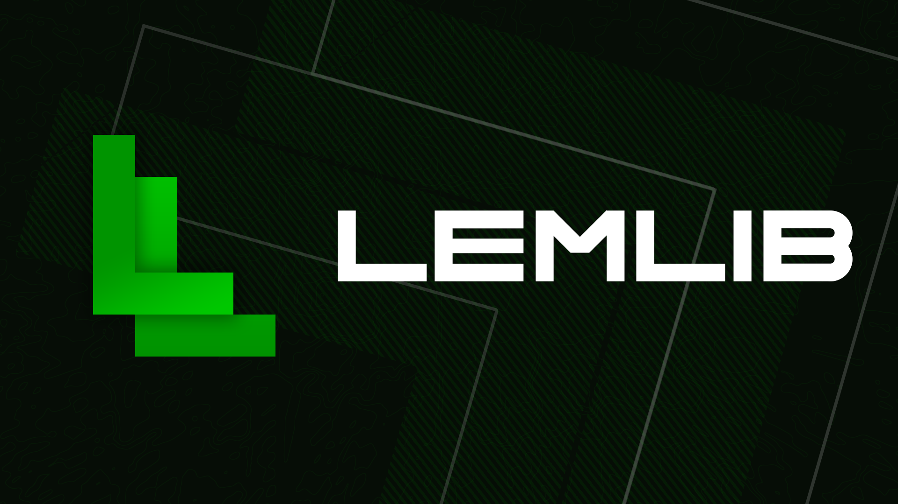

    
    
    
    
    

Welcome to LemLib! This open-source PROS template aims to introduce common algorithms like Pure Pursuit and Odometry for new and experienced teams alike.

The creation of this template was inspired by [EZ-Template](https://github.com/EZ-Robotics/EZ-Template) and [OkapiLib](https://github.com/OkapiLib/OkapiLib). We aim to develop a library that strikes a balance between ease-of-use, akin to that of EZ-Template, and comprehensive functionality, similar to that of OkapiLib.

> Want a place to chat with the devs and other users? Join our [Discord server](https://discord.gg/pCHr7XZUTj).

## License
This project is licensed under the MIT license. Check [LICENSE](https://github.com/LemLib/LemLib/blob/master/LICENSE) for more details.

## Features
- Generic PID class
- Odometry
- Odom turn to face point
- [Boomerang controller](https://www.desmos.com/calculator/sptjw5szex)
- Pure Pursuit
- Motion Chaining
- Driver Control

## Example Project
You can find a fully annotated example project [here](https://github.com/LemLib/LemLib/blob/stable/src/main.cpp).

## Tutorials
The [tutorials](https://lemlib.readthedocs.io/en/v0.5.0/tutorials/1_getting_started.html) provide a detailed walkthrough through all the features of LemLib. It covers everything from installation to Path Following:

## FAQ
_**1. Help! Why is my controller vibrating?**_
If your controller vibrated more than once, your inertial sensor calibration failed.
Check if its connected to the right port and try again.

_**2. What drivetrains are supported?**_
Only tank/differential.
This is not going to change until other drivetrains are competitive.

_**3. Do I need tracking wheels?**_
No, but it is recommended.
You should absolutely have a horizontal tracking wheel if you don't have traction wheels, and you have to spend extra effort tuning your movements to prevent any wheel slip.

_**4. Do I need an inertial sensor?**_
No, but it is highly recommended.
The one exception to this would be if you have 2 parallel tracking wheels which are tuned well and are perfectly square. LemLib will work without it, but the accuracy will be compromised. 

_**5. Do I need an SD card?**_
As of v0.5.0, no SD card is necessary.

_**6. What are the units?**_
The units are inches and degrees.
In a future release, Qunits will be used so you can use whatever units you like.

_**7. Is LemLib V5RC legal?**_
Yes.
Per the RECF student-centred policy, in the context of third-party libraries.
> Students should be able to understand and explain the code used on their robots

In other words, you need to know how LemLib works. You don't need to know the details like all the math, just more or less how the algorithm works. If you want to learn more about LemLib, you can look through the documentation and ask questions on our Discord server.

## Documentation
Check out the [Documentation](https://lemlib.readthedocs.io/en/v0.5.0/index.html).

## Contributing
Want to contribute? Please read [CONTRIBUTING.md](https://github.com/LemLib/LemLib/blob/master/.github/CONTRIBUTING.md) and join our [Discord server](https://discord.gg/pCHr7XZUTj).

## Code of Conduct
See the [Code of Conduct](https://github.com/LemLib/LemLib/blob/master/.github/CODE_OF_CONDUCT.md) on how to behave like an adult.

---

## Custom Changes (Team-Specific)

This fork extends LemLib with a custom `pushback` library and team-specific autonomous routines for VRC Push Back (2025-2026).

### `pushback` Library (`include/pushback/`, `src/pushback/`)

A custom hardware abstraction layer built on top of LemLib.

#### `Robot` class
Centralizes all robot hardware into a single object for easy access across autonomous routines and subsystems.
- Holds references to 3 intake motors, up to 4 pistons, 2 distance sensors, an IMU, optical sensor, and controller
- Wall distance reset methods: `reset_x()`, `reset_y()`, `safe_to_reset_x()`, `safe_to_reset_y()`, `filter_x()`, `filter_y()`
- `ram(magnitude, time)` — drive at a fixed power for a fixed duration
- `jiggle(magnitude, cycle_time, time)` — oscillate forward/back to dislodge balls from a loader
- `go_until_front(...)` — drive until a front distance sensor target is reached
- `set_distance_offset(offset)` — configure distance sensor mounting offset in inches

#### `Intake` class
Manages the 3-stage intake (first stage, mid stage, high stage).
- `intake()` / `outake()` / `stop()` — full intake control
- `mid_goal()` / `mid_goal_strong()` / `mid_goal_weak()` — score into low/mid goals at different voltages
- `tall_goal()` — score into tall goals (deploys piston)
- `runIntake()` — maps controller buttons to intake actions (call every opcontrol loop)
- `color_sort()` — optical sensor-based color sorting; ejects opponent-colored balls automatically
- `anti_jam()` — detects intake jam via torque and reverses briefly to clear it

#### `Piston` class
Wraps `pros::ADIDigitalOut` with toggle support for driver control.
- `firePiston(bool)` — directly set piston state
- `toggleFire()` — toggle on button press (call every opcontrol loop)
- `register_controller(robot)` — links piston to controller for toggle input

### Hardware Configuration (`src/main.cpp`)

| Component | Ports | Notes |
|---|---|---|
| Left drive motors | 13, 14, 15 (reversed) | Blue gearset |
| Right drive motors | 16, 17, 18 | Blue gearset |
| Intake stage 1 | 19 | Green gearset |
| Intake stage 2 | 20 | Green gearset |
| Intake stage 3 | 11 | Green gearset |
| IMU | 12 | |
| Optical sensor | 3 | Color sorting |
| Horizontal tracking wheel | 10 | 2" diameter, rotation sensor |
| Vertical tracking wheel | 9 | 2" diameter, rotation sensor |
| Left distance sensor | 2 | Wall position reset |
| Right distance sensor | 10 | Wall position reset |
| Unloader piston | ADI port 2 | Button: D-pad Down |
| Score toggle piston | ADI port 3 | Button: B |
| Descore piston | ADI port 1 | Button: Y |

**Drivetrain:** 10.8" track width, 3.25" wheels, 450 RPM

**PID Gains:**
- Linear: kP=8.5, kD=9, slew=15
- Angular: kP=3.95, kD=29, slew=20

### Autonomous Routines

| Routine | Description |
|---|---|
| `awp()` | Autonomous Win Point — scores in long goal, mid goal, and matchloader |
| `skills()` | Full 60-second skills run, 4 goals + barrier crossing |
| `elimLeft()` | Left-side elimination routine with pure pursuit path following |
| `elimLeftSafe()` | Safer variant of `elimLeft` with extra mid-goal timing |
| `elimRight()` | Right-side elimination routine |
| `elimRightFast()` | Faster variant of `elimRight` |
| `elimLeftButOnRight()` | Left-side elim strategy run from the right side |
| `elimRightButOnLeft()` | Right-side elim strategy run from the left side |
| `right_4_3()` | Right-side routine targeting 4 low + 3 high goal balls |
| `highlandQuals()` | Quals routine for Highland tournament |
| `highlandElims()` | Elims routine for Highland tournament |
| `norcalRight()` | NorCal qualifier right-side routine |
| `sevenBlockRight()` | 7-ball right-side routine using pure pursuit |
| `SSAWP()` | Skills-style AWP using mid goal + matchloader |
| `left_side_red()` | Red alliance left-side auton (legacy) |

### Helper Functions

| Function | Description |
|---|---|
| `moveStraight(length, timeout, params)` | Move forward/back relative to current heading |
| `mP(pose, timeout, params)` | Shorthand for `chassis.moveToPose` |
| `brake()` / `real_brake()` / `rb(time)` | Briefly hold brakes then release |
| `reset_robot()` | Background task: continuously resets position using wall sensors and runs color sort |
| `logData()` | Background task: logs odometry to serial at 50ms intervals for the path visualizer |

### Path Visualizer (`visualizers/`)

Includes a Python-based field visualizer (`vis.py`) that parses serial odometry logs and renders the robot's path on a field diagram. Logs are saved to `visualizers/logs.txt` and archived in `visualizers/oldLogs/`.
